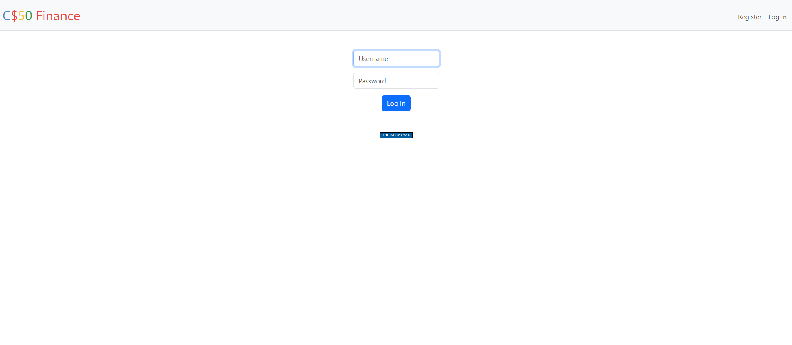
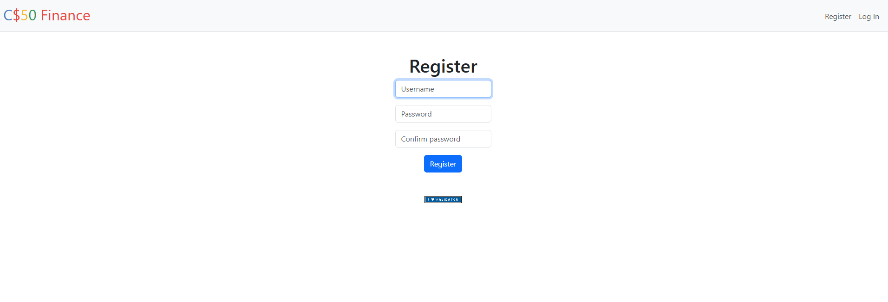
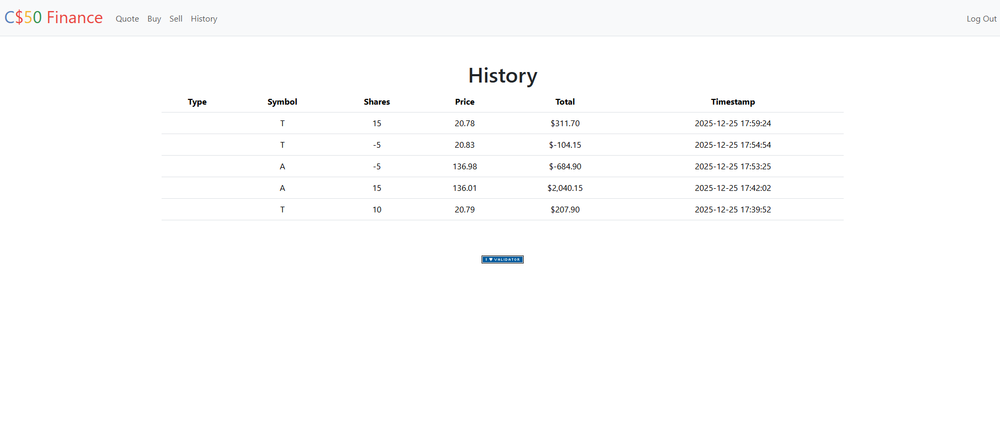

# Flask Finance App

Web application built with Python and Flask that allows users to manage a virtual stock portfolio.

## Features
- User registration and login
- Buy and sell stocks
- Real-time price lookup
- Transaction history
- Secure password hashing

## 📁 Project Structure

flask-finance-app/
├── app.py
├── helpers.py
├── requirements.txt
├── static/
├── templates/
├── README.md
├── .gitignore
└── finance.db

## Tech Stack
- Python
- Flask
- SQLite
- HTML / CSS
- Bootstrap

## Installation
bash
pip install -r requirements.txt
flask run

## Screenshots

### Login Page

*Securely sign in to your account to manage your virtual stock portfolio and access personalized financial features.*

### Register

*Create a new account to start tracking and trading stocks with secure authentication and password hashing.*

### Dashboard

*View an overview of your portfolio with current balances and real‑time stock price information.*

### Buy Stock

*Search for real‑time stock prices and buy shares to grow your virtual investments with ease.*

### History

*Review a complete log of all your stock transactions, including buys and sells, for accurate tracking.*
