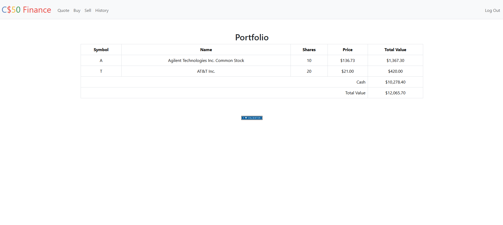
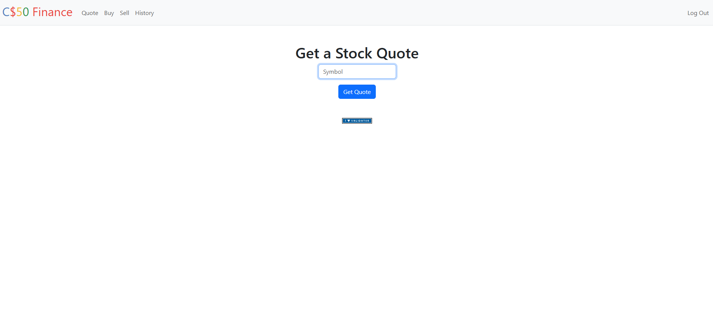

# Flask Finance App

Web application built with Python and Flask that allows users to manage a virtual stock portfolio.

## Features
- User registration and login
- Buy and sell stocks
- Real-time price lookup
- Transaction history
- Secure password hashing

## Tech Stack
- Python
- Flask
- SQLite
- HTML / CSS
- Bootstrap

## Installation
```bash
pip install -r requirements.txt
flask run

## Screenshots

### Login
[image]([https://user-images.githubusercontent.com/...](https://github.com/tauil2895/flask-finance-app/blob/main/screenshots/login.png))

### Dashboard


### Buy Stock

